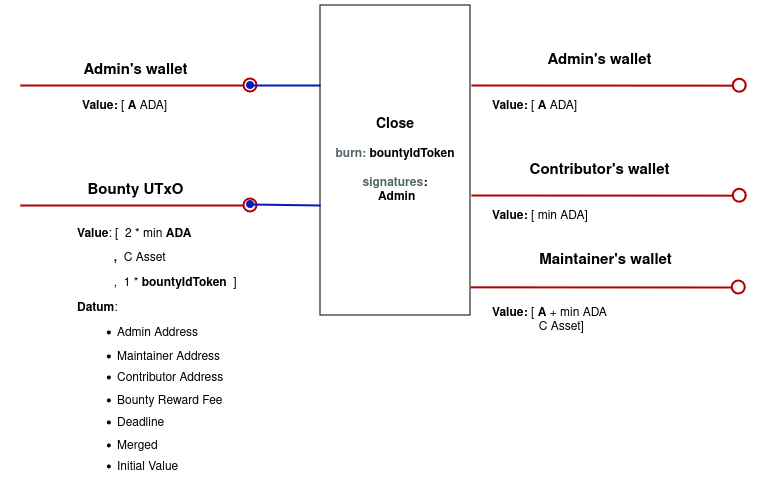
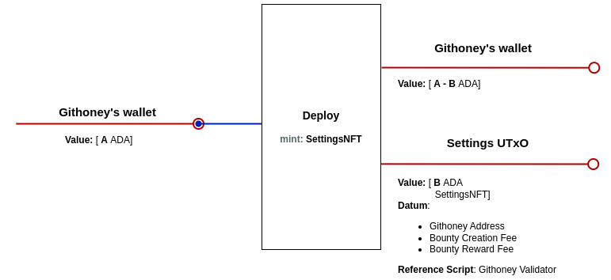
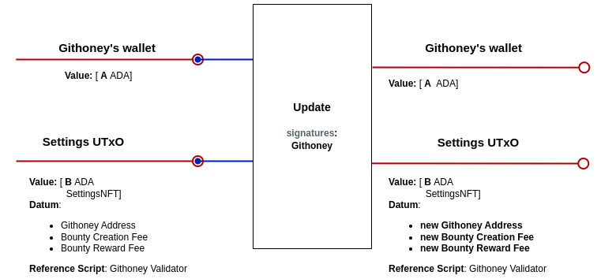
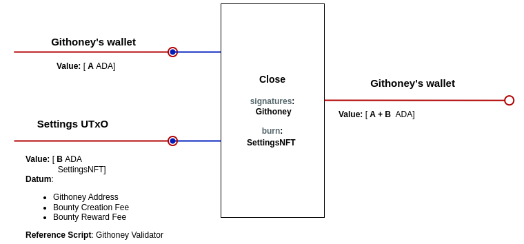

# GitHoney dApp Design

## Introduction

This document describes the technical design of the GitHoney dApp - the script UTxOs involved, the operations that take place during the bounty lifecycle, and the necessary validators and minting policies.

There will be a single `BountyUtxo` for each bounty, holding the reward assets deposited by the maintainers. A `BountyIdToken` will be minted and held in the `BountyUtxo` during the bounty creation. Initially, the contributor field in the datum will be null until a developer decides to work on that bounty, at which point their `Wallet` will be added to the datum. The `BountyIdToken` ensures the correctness of the `BountyUtxo` datum, the initial payment of the bounty creation fee to GitHoney, and also that the reward assets are not null. The presence of the `BountyIdToken` within a UTxO held at the validator address will prove that the UTxO is a `BountyUtxo`. The token name of the `BountyIdToken` will be the bounty identifier, and will be burnt when the bounty is closed or claimed.
**Multivalidators** will be utilized, meaning both scripts share the same parameters. Consequently, the script address and the minting policy ID are identical. This enables identification of the policy ID of the `BountyIdToken` within the validator and the validator address within the minting policy.
Additionally, global parameters of the validator (e.g. the GitHoney wallet, creation fee, and reward fee) and minting policy are stored in the `Settings Utxo` identified by an `NFT policy ID`. This will allow for easy updating of the settings parameters without the redeploying the scripts.

## UTxOs Specification

### BountyUtxo

> #### Address
>
> - Parameterized on the `NFT policy ID`.
>
> #### Datum
>
> - admin: **Wallet**
> - maintainer: **Wallet**
> - contributor: **Optional(Wallet)** (if assigned)
> - bounty_reward_fee: **Bigint**
> - deadline: **POSIXTime**
> - merged: **Bool**
>
> #### Value
>
> - minAda
> - reward_assets
> - `BountyIdToken`

### Settings Utxo

> #### Address
>
> - No parameters
>
> #### Datum
>
> - githoney_wallet: **Wallet**
> - bounty_creation_fee: **Bigint**
> - bounty_reward_fee: **Bigint**
>
> #### Value
>
> - minAda
> - `SettingsNFT`
>
> #### Reference Scripts
>
> - `Githoney Validator`

### BountyIdToken

The `BountyIdToken` is a minted token that is used to validate the `BountyUtxo`, identifies the bounty with the token name and ensure the correctness of the datum.

### SettingsNFT

The `Settings NFT` is a one-time minted token used to validate the correctness of the `Settings Utxo` datum and identify the UTxOs authenticity from the `Githoney Validator`.

## Bounty Transactions

All the following transactions will take a reference input of the `settings Utxo`, for simplicity we will not include it in the diagrams.

### Create BountyUtxo

This transaction creates a `BountyUtxo` locking the reward assets plus min ADA and a `BountyIdToken`. It sets the maintainer, deadline, admin, and merged (**set to False**) in the datum.

```typescript
/**
 * Builds a `createBounty` transaction. The tx is built in the context of the maintainer wallet.
 * @param settingsUtxo The settings UTxO.
 * @param maintainerAddr The maintainer's address.
 * @param adminAddr The admin's address.
 * @param rewards The reward assets and amount to be locked in the bounty UTxO.
 * @param deadline The deadline for the bounty.
 * @param bounty_id The bounty identifier.
 * @param lucid Lucid instance.
 * @returns The cbor of the unsigned transaction.
 */
async function createBounty(
  settingsUtxo: UTxO,
  maintainerAddr: string,
  adminAddr: string,
  rewards: Assets,
  deadline: bigint,
  bounty_id: string,
  lucid: Lucid
): Promise<string>;
```


### Add Reward

Adds additional reward assets to an existing `BountyUtxo`. The bounty must not be closed or merged.

```typescript
/**
 * Builds an `addReward` transaction. The tx is built in the context of any wallet.
 * @param settingsUtxo The settings UTxO.
 * @param utxoRef The reference of the last transaction output that contains the bounty UTxO.
 * @param address The address of the current wallet.
 * @param rewards The reward assets and amount to be added.
 * @param lucid Lucid instance.
 * @returns The cbor of the unsigned transaction.
 */
async function addRewards(
  settingsUtxo: UTxO,
  utxoRef: OutRef,
  address: string,
  rewards: Assets,
  lucid: Lucid
): Promise<string>;
```


### Assign Contributor

Sets the contributor's `Wallet` to the `BountyUtxo` datum and adds the contributor's min ADA to the value.

```typescript
/**
 * Builds an `assignContributor` transaction. The tx is built in the context of the contributor wallet.
 * @param settingsUtxo The settings UTxO.
 * @param utxoRef The reference of the last transaction output that contains the bounty UTxO.
 * @param contributorAddr The contributor's address.
 * @param lucid Lucid instance.
 * @returns The cbor of the unsigned transaction.
 */
async function assignContributor(
  settingsUtxo: UTxO,
  utxoRef: OutRef,
  contributorAddr: string,
  lucid: Lucid
): Promise<string>;
```


### Close Bounty

The admin closes the bounty, returning the reward assets to the maintainer and burning the `BountyIdToken`. If a contributor is assigned, the min ADA is returned to them.

```typescript
/**
 * Builds a `closeBounty` transaction. The tx is built in the context of the admin wallet.
 * @param settingsUtxo The settings UTxO.
 * @param lucid Lucid instance.
 * @param utxoRef The reference of the last transaction output that contains the bounty UTxO.
 * @returns The cbor of the unsigned transaction.
 */
async function closeBounty(
  settingsUtxo: UTxO,
  utxoRef: OutRef,
  lucid: Lucid
): Promise<string>;
```

#### Close Bounty Before Contributor Assignment


#### Close Bounty After Contributor Assignment



### Merge Bounty

Pays GitHoney the reward assets multiplied by the `BountyRewardFee`. Updates the merged field to _True_. The contributor's min ADAs remain in the UTxO.

```typescript
/**
 * Builds a `mergeBounty` transaction. The tx is built in the context of the admin wallet.
 * @param settingsUtxo The settings UTxO.
 * @param utxoRef The reference of the last transaction output that contains the bounty UTxO.
 * @param lucid Lucid instance.
 * @returns The cbor of the unsigned transaction.
 */
async function mergeBounty(
  settingsUtxo: UTxO,
  utxoRef: OutRef,
  lucid: Lucid
): Promise<string>;
```


### Claim Bounty

Pays the contributor the remaining reward assets and burns the `BountyIdToken`.

```typescript
/**
 * Builds a `claimBounty` transaction. The tx is built in the context of the contributor wallet.
 * @param settingsUtxo The settings UTxO.
 * @param utxoRef The reference of the last transaction output that contains the bounty UTxO.
 * @param lucid Lucid instance.
 * @param contributorAdrr The contributor's address.
 * @returns The cbor of the unsigned transaction.
 */
async function claimBounty(
  settingsUtxo: UTxO,
  utxoRef: OutRef,
  lucid: Lucid,
  contributorAddr: string
): Promise<string>;
```


## Settings Transactions

### Deploy Settings

This transaction deploys the `GlobalSettings` UTxO, which holds the global parameters of the dApp. The NFT policy ID of the minted token identifies the `GlobalSettings` UTxO. Besides the settings, the utxo will hold also the `Githoney Validator` code, due to this utxo will be used as reference input of all the redeemers of the `Githoney Validator`.

```typescript
/**
 * Builds a `deploy` transaction. The tx is built in the context of the GitHoney address. This transaction configures the global parameters of the dApp, including the creation fee, reward fee, and the GitHoney wallet. These parameters are obtained from the environment configuration.
 * @param lucid Lucid instance.
 * @returns The cbor of the unsigned transaction and a output reference from the asoociated wallet.
 */
async function deploySettings(
  lucid: Lucid
): Promise<{ cbor: string; outRef: OutRef }>;
```



### Update Settings

Updates the global parameters of the dApp, changing the datum of the `GlobalSettings` UTxO.

```typescript
/**
 * Builds an `update` transaction. The tx is built in the context of the GitHoney address.
 * @param settingsUtxo The settings UTxO.
 * @param lucid Lucid instance.
 * @param settings The new settings to be updated (Optional).
 * @returns The cbor of the unsigned transaction.
 */
async function updateSettings(
  settingsUtxo: UTxO,
  lucid: Lucid,
  settings?: {
    githoneyWallet: {
      paymentKey: string;
      stakeKey: string | null;
    };
    creationFee: bigint;
    rewardFee: bigint;
  }
): Promise<string>;
```



### Close Settings

Closes the `GlobalSettings` UTxO, burning the NFT and refunding the ADA locked to githoney.

```typescript
/**
 * Builds a `closeSettings` transaction. The tx is built in the context of the GitHoney address.
 * @param utxoRef The output reference passed as parameter of the settings nft minting policy,
 * this outRef is returned in the deploySettings operation.
 * @param settingsUtxo The settings UTxO.
 * @param lucid Lucid instance.
 * @returns The cbor of the unsigned transaction.
 */

async function closeSettings(
  utxoRef: OutRef,
  settingsUtxo: UTxO,
  lucid: Lucid
): Promise<string>;
```



## Validators & Minting Policies

### BountyValidator

- Params: `NFT policy ID`.

#### General Checks for all **Redeemers**

- `BountyUtxo` input with a `bountyIdToken`.

#### **AddReward Redeemer**

- The `deadline` has not been reached.
- `BountyUtxo` output value includes the input value plus additional reward assets.
- Datum doesn't change.

#### **AssignContributor Redeemer**

- The `deadline` has not been reached.
- The `contributor` field in the datum is null.
- Contributor's `Wallet` is added to the `BountyUtxo` datum, and the rest of the datum fields are the same.
- UTxO assets are the same plus min ADAs.

#### **CloseBounty Redeemer**

- `BountyIdToken` is burnt.
- The merged field is False.
- Reward assets and the min ADAs are paid back to the maintainer.
- If the `contributor` is setted the min ADAs are paid back to the contributor.
- Datum Admin address signed the transaction.

#### **MergeBounty Redeemer**

- Only one reference input holding a token with the `NFT policy ID`.
- The merged field is False.
- The `deadline` has not passed.
- There is a contributor assigned.
- Reward assets times `BountyRewardFee` is paid to the `GitHoneyAddress`, the min ADAs are paid back to the maintainer, and the rest of the assets remain in the UTxO.
- Datum Admin address signed the transaction.
- Datum merged field is updated to True, and the rest of the datum fields are the same.

#### **ClaimBounty Redeemer**

- The merged field is True.
- `BountyIdToken` is burnt.
- The remaining reward assets in UTxO are paid to the `contributor`'s `Wallet`.

### `bountyIdToken` mintingPolicy

- Params: `NFT policy ID`.

#### MINT

- Only one reference input holding a token with the `NFT policy ID`.
- A single `BountyIdToken` is minted.
- The minted token and the min ADAs are paid to the `BountyValidatorAddress`.
- There are some reward assets paid to the `BountyUtxo`.
- The datum of the `BountyUtxo` is checked for correctness:
- Deadline must be in the future.
- Merged field must be False.
- Contributor field must be null.
- Bounty reward fee must be greater than 0.

#### BURN

- Without checks

### SettingsValidator

- No Params

#### **UpdateSettings Redeemer**

- The datum `GitHoneyAddress` signed the transaction.
- There is only one token besides ADA in the input `Settings Utxo`.
- The token is in the output `Settings Utxo`.
- The new datum have the correct format.

#### **CloseSettings Redeemer**

- The datum `GitHoneyAddress` signed the transaction.
- The `Settings Utxo` value is payed to the `GitHoneyAddress`.
- The NFT is burnt.

### SettingsMintingPolicy

- Params: `OutRef`

#### MINT

- Only one token is minted.
- The `OutRef` is in the inputs.
- The token is paid to the first output with a datum
  with the correct format.

#### BURN

- Without checks
